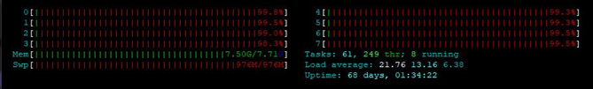
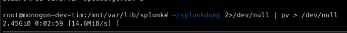
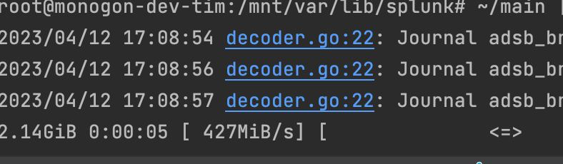
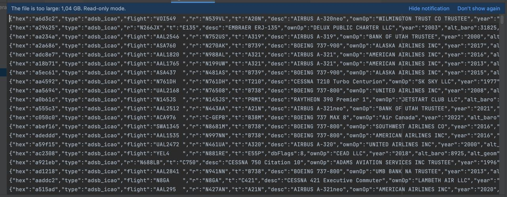

For some time now I have been helping out in a group of friends who are building their own [ASDB](https://en.wikipedia.org/wiki/Automatic_Dependent_Surveillance%E2%80%93Broadcast) network to track airplanes flying over Europe. As they wanted to store the data for later use, aggregation, and enrichment, they started importing the JSON data that [readsb](https://github.com/wiedehopf/readsb) wrote into a Splunk instance. When asked why Splunk was chosen, the response was that nobody knew how to do it better, and they already had a license anyway, so why not give it a try.

Fast-forward about 8 months, and the Splunk database uses about 800 GiB of disk space. The 10 GiB/day of ingest that the developer license allows is nearly filled.

Around that time, I became more active again inside this group and decided to inquire about what they were currently doing with the data. It was quickly explained to me, but I had no prior knowledge of how Splunk works, and I only remembered it as a glorified logfile. Since I was already familiar with Clickhouse and considering that each ADSB message is just 14 bytes long, I made the decision to migrate the current stack to Clickhouse. The process of ingesting data was fairly simple as I just [patched](https://github.com/fionera/readsb/commit/d5202c31db6239774eb4c314768e43f1aa0ae40a) readsb to allow transmission of the aggregated data to Kafka which then was read by Clickhouse.

Now that I had a pipeline to store new data, I also wanted to ingest the historic data. However, this turned out to be a bigger challenge than I had hoped for. I approached the person who administrated the Splunk instance and asked if he could provide me with the data, to which he agreed.

Exporting the data using the built-in exporter proved to be a less than optimal experience. The exporter was not efficient and used up too much memory, making the process not feasible.

> this was the system load when trying to export one day of data

So, I decided to inspect the format of the data and found out that the data was stored in journal files, which were compressed using zstd.

Decompressing and inspecting these files inside a Hex-Editor directly showed the raw data, but I didn't just want to filter the json out of these binary files. I wanted a real splunk database reader that understood everything. 

The first few fields where easy to guess but after some time I ran into problems as I didn't understood how the size of the actual content was encoded. To overcome this hurdle, I turned to Google for answers and discovered the existence of the [Bucket Reader](https://splunkbase.splunk.com/app/2759). This app allowed to read the Splunk bucket files directly using Hadoop, since I dont really care about Hadoop I just looked into the libraries bundled with it and was directly greeted with a Java implementation of the journal file format. 

While implementing the reader I also started to gain interest in optimizing it.

After about an evening of implementing the format and another day of optimizing the reader to read-ahead and use an optimized varint decoder I was at the current speed of about half a gigabyte per second. There is probably still room to improve, e.g. using simd instructions to accelerate the varint decoding even more but this has to be it for now. 

With all these optimizations I was able to decode the 800GB of compressed data in about 30 minutes.

